# How to Log Into a Course-Specific Account on "**ieng6**."

**Step 1. Download and open VScode**


To do this, go to [this link](https://code.visualstudio.com/), download VScode for whichever operating system you're using, and follow their directions for installation (for this example we'll be using macOS). Once installed it open it and it should look like this:

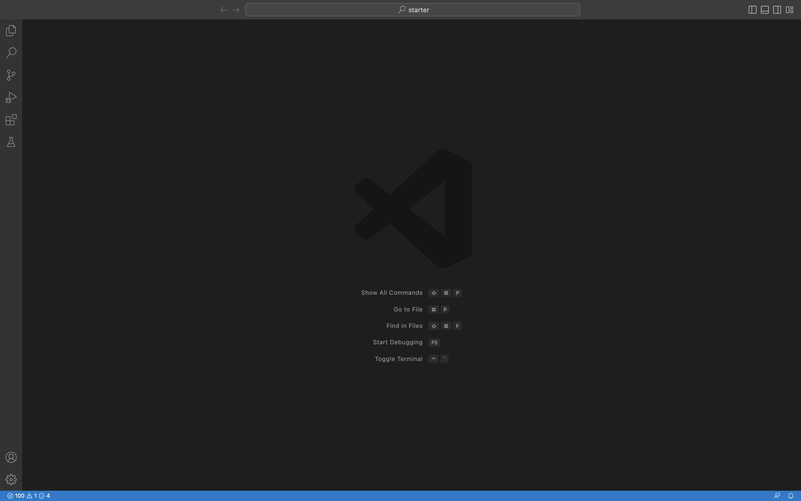

**Step 2. Open Terminal within VScode**

In VScode bring your cursor all the way up so that the drop down menus show. Click "Terminal" then "New Terminal",  and your VScode should look like this with the Terminal at the bottom of the screen:

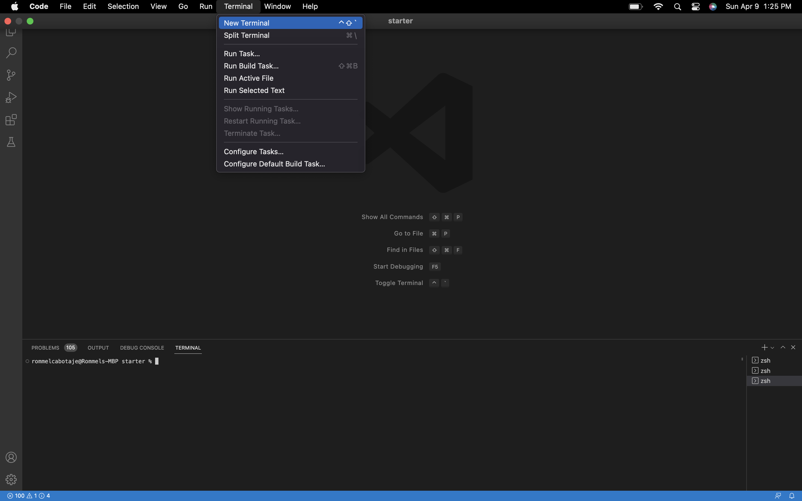

**Step 3. Get your course-specific username and set your password for it.**

To get your username log into [here](https://sdacs.ucsd.edu/~icc/index.php) with your regular tritonlink username and PID. It should look like this:

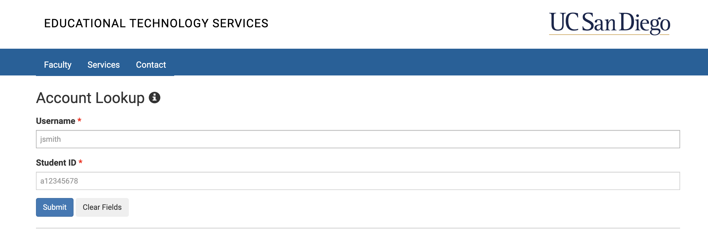

Under "Additional Accounts" you'll see your course-specific username(s). Click the course you're looking for (in this case cse15l).
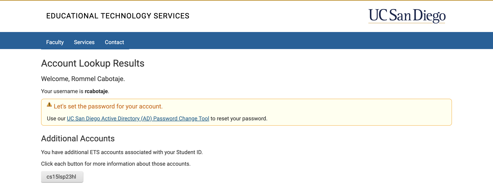

Once clicked, you'll see your username under it click "Global Password Change Tool":
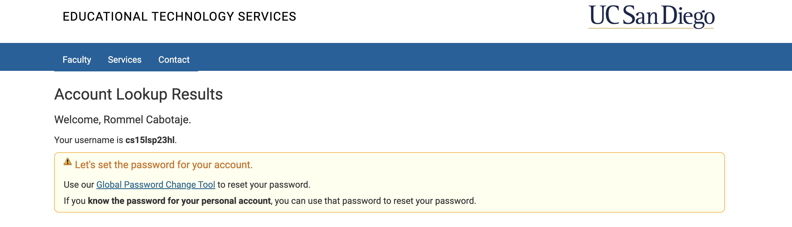

Then click "Proceed to the Password Change Tool":
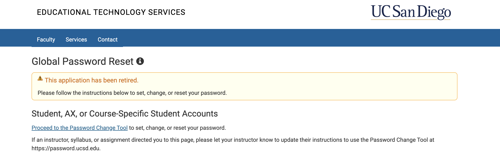

Enter your course-specific username (in this case the cse15l*****):
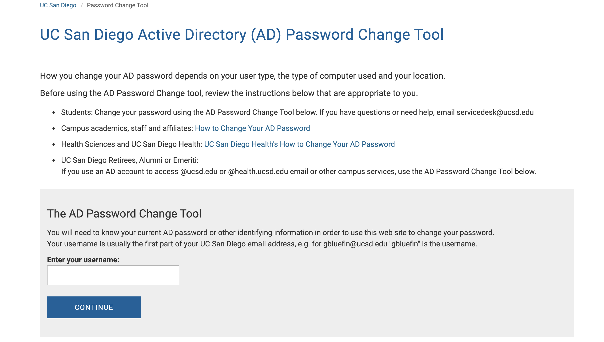


Click "I want to reset my course-specific account password":
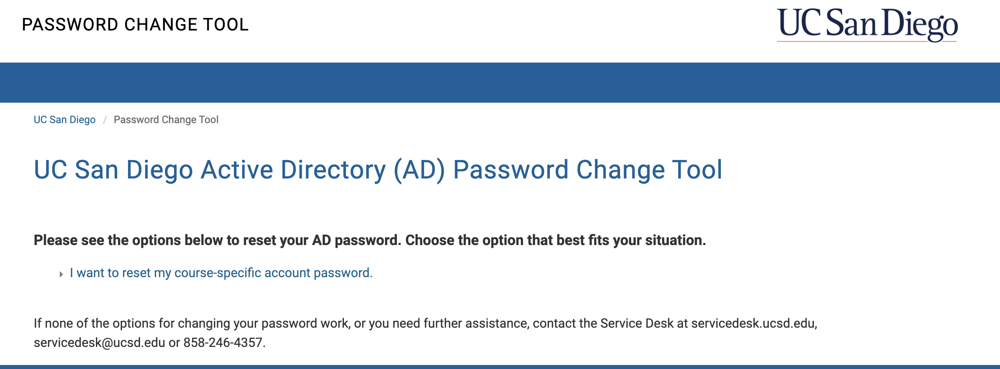

Change your password:
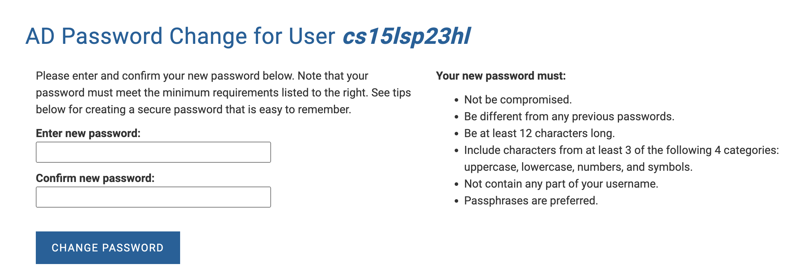
After resetting your password wait 15 mins for the password change to take effect.


**Step 5: Log Into Your "ieng6" Account**

Go to back to VScode with the terminal open. Type inside the terminal `ssh course-specific-usename@ieng.ucsd.edu`, hit return on your keyboard, then it'll prompt you to enter the your password you just set:

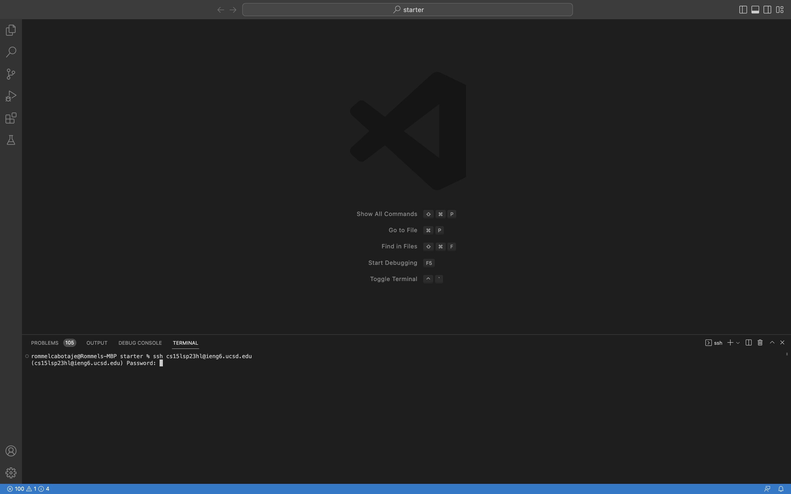

Once logged in, your terminal should output this:
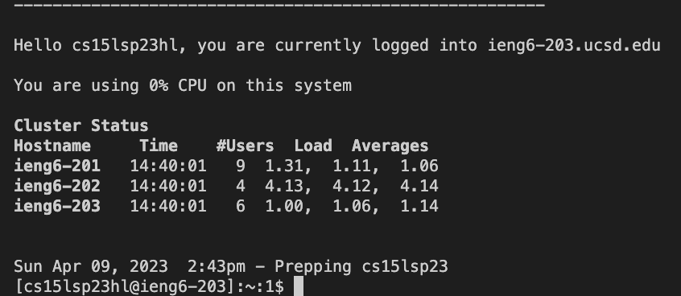

**Step 6: Try out some Commands:**
Now you should try out some commands to see how they work and what they lead to. 
Some commands you can try are:

```
cd
ls
pwd
mkdir
cat
cp
ls -lat
ls -a
```

Here are examples of commands that have been ran:

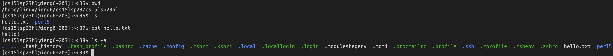
