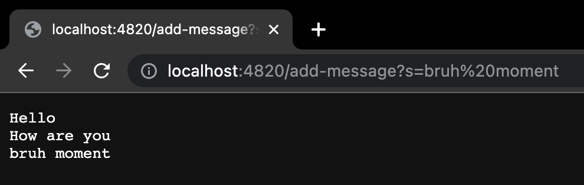
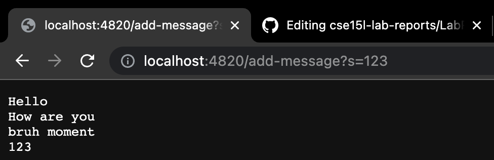
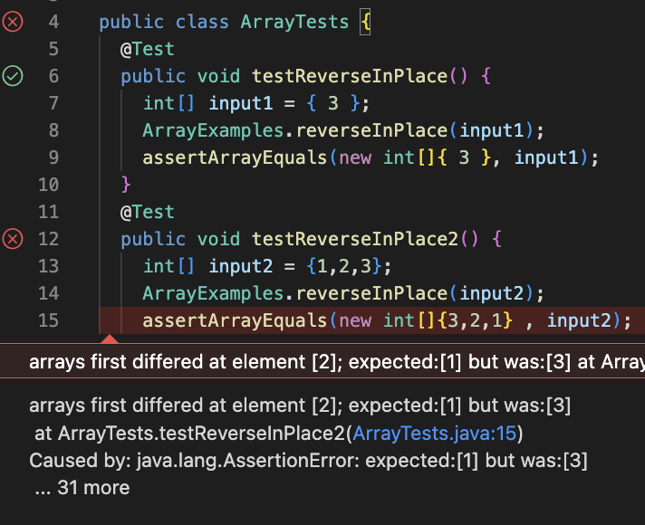

# Part 1

**StringServer Code**

```
import java.io.IOException;
import java.net.URI;

class Handler implements URLHandler {
    String bruh ="";
    public String handleRequest(URI url) {
        if(url.getPath().equals("/add-message")){
            String[] parameters = url.getQuery().split("=");
            bruh+= parameters[1]+ "\n";
            return bruh;
        }
        else{
            return "404 not found";
        }
    }
}
public class StringServer {
    public static void main(String[] args) throws IOException {
        if(args.length == 0){
            System.out.println("Missing port number! Try any number between 1024 to 49151");
            return;
        }

        int port = Integer.parseInt(args[0]);

        Server.start(port, new Handler());
    }
}
```

**1st `/add-message` ScreenShot**

* The methods called from the code is the *handleRequest* method, it is called when we to add a message to the server.
* A relevant argument in the *handleRequest* if we want to add a message it checks the URL for the "/add-message" query.
* The value from String s changes. Before it I added "bruh moment" it was "Hello \nHow are you\n" then after the method *handleRequest* gets called it changes to "Hello\nHow are you\nbruh moment".

**2nd `/add-message` ScreenShot**

* The methods called from the code is the *handleRequest* method, it is called when we to add a message to the server.
* Just like the previous screenshot the relevant argument in the *handleRequest* if we want to add a message it checks the URL for the "/add-message" query.
* The value from String s changes. Before it I added "123" it was "Hello\nHow are you\nbruh moment\n" then after the method *handleRequest* gets called it changes to "Hello\nHow are you\nbruh moment\n123\n".

---
# Part 2

**Failure-inducing Input**
```
public void testReverseInPlace2() {
    int[] input2 = {1,2,3};
    ArrayExamples.reverseInPlace(input2);
    assertArrayEquals(new int[]{3,2,1} , input2);
}
```
**Pass-inducing Input**
```
public void testReverseInPlace() {
    int[] input1 = { 3 };
    ArrayExamples.reverseInPlace(input1);
    assertArrayEquals(new int[]{ 3 }, input1);
}
```
**Symptom as JUnit**



**Bug Before/After**
Before:
```
static void reverseInPlace(int[] arr) {
    for(int i = 0; i < arr.length; i += 1) {
      arr[i] = arr[arr.length - i - 1];
    }
}
```
After:
```
static void reverseInPlace(int[] arr) {
    for(int i = 0; i < arr.length/2; i += 1) {
      int temp = arr[arr.length - i - 1];
      int temp2 = arr[i];
      arr[i] = temp;
      arr[arr.length-i-1]= temp2;
    }
  }
```
* The fix addresses the issue because at first the code was reversing the array wrong {1,2,3} would be {3,1,3} becuase it would switch the last index with the first one, which was already switched. So by making two temp variables it strored what changed and what needs to be changed and changed both of them at the same time. Also since we are switching the it at the same time we only need to go halfway throught the list, bc if we went through the whole list we'd end up with the same list we started out with.

---
# Part 3
* Something I learned from lab 2 was how to make a server. With learning how to make a server this made me learn about the things we that could be applied with it, like using implementing paths and queries to the server's link in order to make it do something based on the server's code for example, add numbers or strings to show up. Also I learned about how we could access in the Terminal by using *curl* and that we could even create the server remotely.
